# Breaking Bad Project Documentation

# Content

[Project architecture](#project-architecture)\
[Modules](#modules)\
[Other](#other)


# APIs used
Breaking bad API\
this API was used to get **characters**, **episodes**, **quotes**.\
[Documentation](https://breakingbadapi.com/documentation)

Pexels API\
This API was used to get **images** depending on occupation of character.\
[Documentation](https://www.pexels.com/api/documentation/)


# Project architecture

For this project we used provider pattern

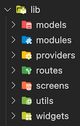


# Modules
Every module generally has 5 essential parts:
**Screen**, **Providers**, **Services**, **Models**, **Widgets**.

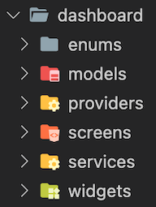

## Models
Models are classes that we use to map the data we get from the API.

## Providers
Provider was used to share values across widget hierarchies, and it allows widgets to bind themselves to values so that they rebuild as needed to reflect state changes.

Providers implemented: **Dashboad**, **Search**, **Home**, **Favorite**, **Details**.

## Routes
There is a separate file for routes. So that we control them from one place.
The project is divided into modules. 

## Screens
In this folder we can find all the screens of that module.

## Services
Services are what we use to fetch data from different sources, in this case an API.

## Utils
Utils is the folder thet contains various utilites such as const proporties that are used across multiple components.

## Widgets
Widgets are extracted so they are reusable.
We have divided the widgets to its modules but some widgets are general so they are on a folder in lib.


# Modules

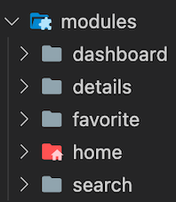

## Dashboard Screen
Dashboard screen is the main screen of the app in this screen are shown 5 top characters which are randomly chosen.

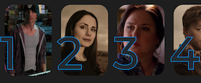

 After top characters widget are lists of all characters divided on tab bar **All**, **Both**, **Baraking Bad**, **Better call Saul**.   

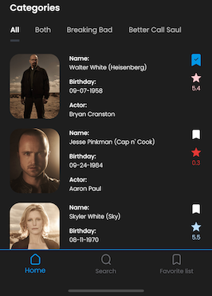

## Details Screen
Details screen is the screen that shows all informations of the character.\
On the top of the screen are shown **image of character**, **image based on first occupation of the character**, **name of the character**, **score**, **occupations of the character**. 

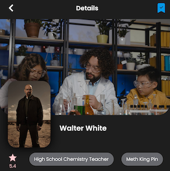

Informations of characters are devided on tabs **Profile**, **Episodes**, **Quotes**.

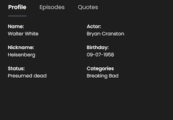 
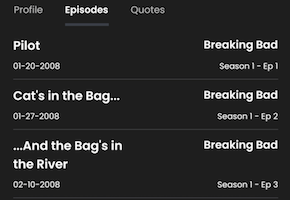 
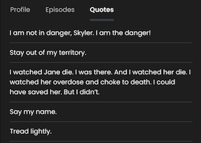

## Favorite Screen
In Favorite screen are shown all the characters that you have marked as favorite and you have the choise to [sort characters](#sort-characters) by **Name**, **Score**, **Modify date**.

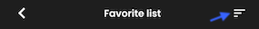
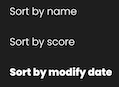

## Home Screen
Home screen is the route screen of the app which contains bottom navigation bar.

## Search Screen
In Search screen you can search for any character by typing name or nickname.

# Assets

## Fonts

Fonts folder is a place where we store all [fonts](#font) which we use on the app.

## Icons

Icon folder is a place where we store all svg [image](#image) for the app.

## Images

Images folder is a place where we store all png, jpeg [image](#image) for the app.


# Other

## Score

  Colors of score icon are generated based on score value.

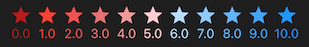 
```dart
Color getColorValue(double score) {
  int value = score.round();

  if (score == 0.0) return Colors.red[900]!;

  if (value <= 5) {
    return Colors.red[600 - value * 100]!;
  } else {
    return Colors.blue[value * 100 - 500]!;
  }
}
```

Stroke for top character number is done with Painter

```dart
Paint()
  ..style = PaintingStyle.stroke
            ..strokeWidth = 2
            ..color = selectedColor,
```

As the Breaking bad API does not provide score 
of character we auto generated that randomly for each character
```dart
double generateRandomScore() {
  Random rng = Random();
  double randomNum = double.parse((rng.nextDouble() * 10).toStringAsFixed(1));
  return randomNum;
}
```  
For storage of favorite characters is used local database with shared preferences package.\
On local database is store only character id

```dart
void addFavoritecharacter(int value) async {
  SharedPreferences prefs = await _prefs;
  _characterIdList.add(value.toString());
  prefs.setStringList('characterIdList', _characterIdList);
}
```

The Breaking bad API does not provide us with top characters. We will temporarily generate them randomly.

```dart 
void getTopCharacters() {
    Random rng = Random();
    Character character;
    int randomCharId = 0;
    while (topCharacters.length < 5) {
      try {
        randomCharId = rng.nextInt(allCharacters.last.charId!);
        character = allCharacters
            .where((element) => element.charId == randomCharId)
            .first;
        if (!topCharacters.contains(character)) {
          topCharacters.add(character);
          ...
```

### Search 

Search field on dashboard screen makes the searches depending on which Tab you are.

```dart 
List<Character> sortCharactersBySearch(
      CharacterCategory characterCategory, String name) {
    _searchedCharacters.clear();
    _searchedCharacters.addAll(sortCharactersByCategory(characterCategory));
    _searchedCharacters.retainWhere((character) {
      return compareTexts(character.name! + character.nickname!, _searchText);
    });
    return sortCharactersController(characterCategory, _searchedCharacters);
  }
```
Search field on search screen makes the searches on all characters.

```dart
void searchCharactersByNameOrNickName(
      List<Character> allCharacters, String value) {
    if (value.isEmpty) {
      searchedCharacters.clear();
    } else {
      searchedCharacters.clear();
      searchedCharacters.addAll(allCharacters);
      searchedCharacters.retainWhere((character) {
        return compareTexts(character.name! + character.nickname!, value);
      });
    }
    notifyListeners();
  }
```

### Sort characters.
Method which is used to sort characters by name on favorite screen
```dart 
void sortCharacterByName() {
  sortedFavoriteCharacters = [];
  sortedFavoriteCharacters.addAll(favoriteCharacters);
  sortedFavoriteCharacters.sort(
    (a, b) => a.name!.toLowerCase().compareTo(b.name!.toLowerCase()),
  );
  favoriteSortType = FavoriteSortType.name;
  notifyListeners();
}
```

### Font

Implementing Poppins font on themeData so we can use that on all texts

```dart
ThemeData themeData = ThemeData(
  fontFamily: 'Poppins',
  ...
```

### Image 

We make const path of images so we can use it in the app for easier control.

```dart
const String imagesPath = 'assets/images/';
const String logo = '${imagesPath}logo.png';
```